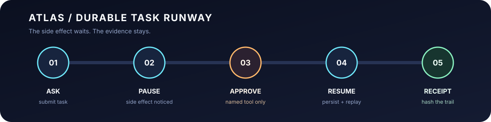

# Atlas Agent Runtime

[](https://github.com/jonah-ux/atlas-agent-runtime/actions/workflows/ci.yml)
[](https://github.com/jonah-ux/atlas-agent-runtime/releases)

**Tiny runtime. Big paper trail.** Atlas is a dependency-free Python runtime for inspectable AI
tasks. It records lifecycle events, pauses side effects for approval, survives a restart, and
produces a deterministic receipt you can inspect without trusting a black box.

<p align="center">
  
</p>

Atlas is useful on its own. The default install, demo, and receipt flow require only this repository
and Python 3.11 or newer. Optional interoperability exports are documented separately; they do not
add a dependency on another portfolio project, private service, or model provider.

## 60-second flight

Explore the self-contained [flight deck](docs/flight-deck.html) to step through the six-event
approval lifecycle. Its browser controls illustrate the states; the CLI below produces the
actual persisted event log and receipt. No model or companion tool is needed for either route.

From a fresh clone, run this copy-paste block:

```bash
python3 -m venv .venv
.venv/bin/python -m pip install -e .
.venv/bin/atlas demo --state ./artifacts/demo-events.jsonl
.venv/bin/atlas receipt demo-task --state ./artifacts/demo-events.jsonl
```

You should see a completed task summary followed by an `atlas-receipt/v1` JSON document with an
event count and SHA-256 fingerprint. No API key, model account, or network service is needed.

Want the guided version with expected output and the optional evidence export? Open the
[60-second walkthrough](docs/quickstart.md).

## What just happened?

The demo is a small, deterministic story:

1. Atlas submits `demo-task` and moves it to `running`.
2. A declared `publish` tool is paused because it has a side effect.
3. Approval is recorded as an event, then the tool runs.
4. The completed lifecycle is reconstructed from JSONL and hashed into a receipt.

The guardrail is the point: an unapproved side effect cannot quietly slip through, and a restart
does not erase the approval trail.

## Install paths

### Editable install for contributors

```bash
python3 -m venv .venv
source .venv/bin/activate
python -m pip install -e .
```

### Build and install a wheel

```bash
python -m pip install build
python -m build --wheel
python -m pip install dist/atlas_agent_runtime-*.whl
```

The package has no runtime dependencies. The CI workflow exercises the editable install, test
suite, and bytecode compilation; the release workflow also installs both wheel and source
distributions as fresh consumers.

## The useful commands

```bash
# deterministic approval + restart demo
atlas demo --state ./artifacts/demo-events.jsonl

# replay the append-only event store and print the content-addressed receipt
atlas receipt demo-task --state ./artifacts/demo-events.jsonl

# optionally project a bounded receipt into ai-work-evidence/v1
atlas evidence demo-task \
  --state ./artifacts/demo-events.jsonl \
  --id fixture-task:001 \
  --created-at 2026-01-01T00:00:00Z \
  --subject "Synthetic approval" \
  --summary "A bounded approval fixture" \
  --fixture portfolio-suite-v2 \
  --out ./artifacts/demo-evidence.json
```

`evidence` is an optional, local projection. It copies bounded metadata and opaque hashes; it does
not copy request text, event details, tool rows, filesystem paths, or credentials. A completed
local lifecycle is reported as `observed`, not deployed or verified.

## Design boundaries

- Provider-neutral core with no model SDK dependency.
- Explicit task states; illegal transitions raise an error.
- Append-only JSONL events, flushed and synchronized before append returns; a failed append is
  rolled back before the in-memory task advances.
- Restart reconstruction with fail-closed checks for malformed JSON, gaps, and impossible states.
- Task-scoped approval for registered tools that explicitly require it.
- Deterministic `atlas-receipt/v1` output with a SHA-256 content fingerprint.
- No arbitrary shell execution, model calls, distributed leases, signed receipts, or production
  reliability claim in this release.

Read the [architecture](docs/architecture.md), [limitations](docs/limitations.md), and
[evidence contract](docs/contracts/ai-work-evidence-v1.md) for the full boundaries.

## Status

Atlas `0.2.0` is a runtime foundation: local lifecycle integrity, approval gates, restart recovery,
deterministic receipts, and a bounded evidence projection. Provider adapters, distributed workers,
richer receipts, and a dashboard are future slices and are not represented as implemented here.

## Contributing and provenance

Prefer small contract-first changes. Add a boundary test, update the architecture and limitations
docs, and run the dependency-free proof before opening a pull request. See
[CONTRIBUTING.md](CONTRIBUTING.md), [PROVENANCE.md](PROVENANCE.md), and [SECURITY.md](SECURITY.md).

### Public release audit

The checked-in `atlas-public-audit/v1` receipt makes the public release surface inspectable:

```console
python scripts/audit_public_surface.py --json
python scripts/audit_public_surface.py --dist-dir ./dist --json
```

It inventories declared build/runtime dependencies, checks the MIT license and annotated-tag
release markers, scans tracked text files for a small set of high-signal credential patterns, and
optionally compares wheel/source-archive bytes with `SHA256SUMS`. Without a distribution directory,
artifact state is reported as `unavailable`. A passing audit is a release aid; it does not claim a
complete DLP system, security certification, reproducible builds across machines, deployment,
adoption, or production readiness.
