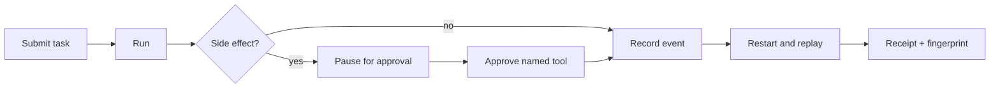

# Atlas in 60 seconds

This walkthrough is intentionally standalone. It uses only the repository, Python 3.11+, and the
standard library at runtime. The event file and evidence file are synthetic local artifacts.

## 1. Install the tiny flight computer

```bash
python3 -m venv .venv
.venv/bin/python3 -m pip install -e .
```

Atlas has no runtime dependencies. An editable install makes the `atlas` command available from
`.venv/bin` without modifying your global Python.

## 2. Let the guardrail do its little dance

```bash
.venv/bin/atlas demo --state ./artifacts/demo-events.jsonl
```

Expected output:

```json
{"events": 6, "state": "completed", "task_id": "demo-task"}
```

The exact JSON key order may differ. The important part is that the task completed after an
approval-gated tool call, and six ordered events were persisted to
`artifacts/demo-events.jsonl`.

## 3. Read the receipt

```bash
.venv/bin/atlas receipt demo-task --state ./artifacts/demo-events.jsonl
```

The result is an `atlas-receipt/v1` document. It contains the task state, ordered events, and a
64-character `receipt_sha256` fingerprint. The fingerprint is an integrity aid, not a signature or
proof of deployment.

You can peek at the event runway with:

```bash
sed -n '1,8p' ./artifacts/demo-events.jsonl
```

Each line is one replayable event. The file contains synthetic fixture text only.

## 4. Optional: make a bounded evidence export

This step is useful when another local tool understands `ai-work-evidence/v1`. It is not needed to
run Atlas and does not contact a provider or service.

```bash
.venv/bin/atlas evidence demo-task \
  --state ./artifacts/demo-events.jsonl \
  --id fixture-task:001 \
  --created-at 2026-01-01T00:00:00Z \
  --subject "Synthetic approval" \
  --summary "A bounded approval fixture" \
  --fixture portfolio-suite-v2 \
  --out ./artifacts/demo-evidence.json
```

The export contains metadata plus artifact hashes. It deliberately omits request text, event
details, tool rows, paths, and credentials. Its status is `observed` because this is a local
lifecycle observation.

## The whole story in one glance



## If something looks odd

| Symptom | Meaning | Next move |
| --- | --- | --- |
| `approval required for tool` | The tool is gated as a side effect. | Run the demo; approval is intentionally recorded before retry. |
| `task not found` | The state path or task id does not match. | Reuse `demo-task` and the same `--state` path. |
| `refusing to overwrite an existing evidence file` | Atlas will not silently replace an artifact. | Choose a new `--out` path or remove the synthetic file yourself. |
| `invalid event` / `non-contiguous sequence` | The event store failed an integrity check. | Preserve the file and inspect it; recovery fails closed by design. |
| append or `fsync` failure | The event could not be synchronized. | The attempted JSONL suffix is rolled back and the task stays at its prior in-memory state; retry only after the storage error is understood. |

## Next stop

- [Architecture](architecture.md) — where the state machine and event store sit.
- [Limitations](limitations.md) — what this release intentionally does not claim.
- [Contributing](../CONTRIBUTING.md) — how to add a contract-first change.

The fun part is the paper trail: Atlas makes the pause, approval, restart, and receipt visible
without pretending a local demo is a production deployment.
